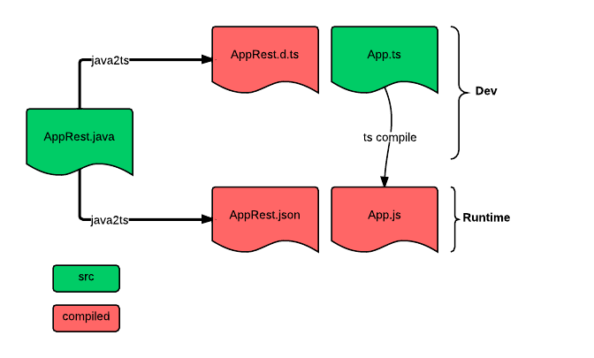

## Continuous Integration
[](https://travis-ci.org/raphaeljolivet/java2typescript/)


### Installation
To install the library using Maven add [JitPack](https://jitpack.io/) repository and java2typescript dependency:

```xml
...
<repositories>
	<repository>
	    <id>jitpack.io</id>
	    <url>https://jitpack.io</url>
	</repository>
</repositories>
...
<dependencies>
    <dependency>
        <groupId>com.github.raphaeljolivet.java2typescript</groupId>
        <artifactId>java2typescript-maven-plugin</artifactId>
        <version>master-SNAPSHOT</version>
    </dependency>
</dependencies>
...
```

> Note, artifacts for this project are built automatically based on github repository by [JitPack](https://jitpack.io/docs/#how-to)

> Note, if You are only interested in generating TypeScript definitions from Java classes, You can use `java2typescript-jackson` instead of `java2typescript-maven-plugin` as the artifact id.

> Note, version can be replaced with
* either any [git tag of this project](tags)
* or any [git commit hash](commits/master)
* or with `master-SNAPSHOT` - to indicate the latest commit of master branch (NB! Dependency managers, such as Maven cache SNAPSHOTs by default, see [JitPack documentation](https://jitpack.io/docs/#snapshots))


## Purpose

**Java2Typescript** provides a bridge between a **Java** REST service definition and a **Typescript** client. 

It enables to expose the full DTO model and REST services API as a clean typescript definition file, thus enabling strong type checking on the model of your application.

This project is composed of 3 modules :
* **[java2typescript-jackson](java2typescript-jackson)**: A [Jackson](http://jackson.codehaus.org/) module that generate **typescript** definition files for Java classes, using a Jackson ObjectMapper.
* **[java2typescript-jaxrs](java2typescript-jaxrs)**: An extension to **java2typescript-jackson** that takes a [JAX-RS](https://jax-rs-spec.java.net/) annotated java class and produces both :
 * A Typescript definition file of the service (`.d.ts`), together with description of all needed DTO objects. 
 * An implementation `.js `of the above definition as REST client stub. 
* **[java2typescript-maven-plugin](java2typescript-maven-plugin)**: A maven plugin to automate the generation of `.d.ts` and `.js` implementation of REST services.
* A **[sample web application](sample-web-app)** that demonstrate the usage of **java2typescript**

## Big picture

Here is a schema of the workflow for a typical project using **j2ts** :


There are only two source files here :
* Server side: `AppRest.java` with annotated JAX-RS services
* Client side: `App.ts` 

The detailed workflow is:

1. `AppRest.java` contains the annotated **JAX-RS** service definition
2. **j2ts** compiles the REST service definition into a `.d.ts` description file, and a `.js` file (runtime implementation)
3. `App.ts` imports and uses the `.d.ts` file
4. `App.ts` is compiled into a `App.js` file (by typescript compiler)

# Usage

Please refer to the documentation of the [maven plugin](java2typescript-maven-plugin) and the example below

# Example

**java2typescript** handles all the HTTP REST standard itself, and provide REST services as vanilla Typescript methods, regardless of the HTTP method / mime to use.

Consider the following JAX-RS service 
```java
@Path( "/people" ) 
public interface PeopleRestService {
	
	
	@Produces( { MediaType.APPLICATION_JSON } )
	@GET
	public Collection< Person > getPeoples( @QueryParam( "page") @DefaultValue( "1" ) final int page ) {
		return peopleService.getPeople( page, 5 );
	}

	@Produces( { MediaType.APPLICATION_JSON } )
	@Path( "/{email}" )
	@GET
	public Person getPeople( @PathParam( "email" ) final String email ) {
		return peopleService.getByEmail( email );
	}
}
```

The **[maven plugin](java2typescript-maven-plugin)** will produce the following typescript definition file :

```typescript
export module People {

export interface PeopleRestService {
    getPeopleList(page: number): Person[];
    getPeople(email: string): Person;
}

export interface Person {
    email: string;
    firstName: string;
    lastName: string;
}

export var rootUrl: string;
export var peopleRestService: PeopleRestService;
export var adapter: (httpMethod: string, path: string, getParams: Object, postParams: Object, body: any)=> void;
}
```

The module **People** contains both the definition of the DTO **Person** and the service **PeopleRestService**, it also provides 3 properties :
* **rootURL** : URL of the service : Should be set before usage
* **peopleRESTService** : An instance of the service
* **adapter** : An adapter for RESt service call. Set to Jquery adapter by default.

Then, in your application, you can call the service like so 
```typescript
/// <reference path="People.d.ts" />
import p = People;
import Person = p.Person;
import prs = p.peopleRestService;

p.rootUrl = "http://someurl/root/";

var personList : Person[] = prs.getPeopleList(1);
var onePerson : Person = prs.getPeople("rrr@eee.com");

```
 
Don't forget to import the generated file **People.js** in the final HTML page.


# Licence

This project is licenced under the [Apache v2.0 Licence](http://www.apache.org/licenses/LICENSE-2.0.html)


# Credits

Jackson module is inspired from the [jsonSchema module](https://github.com/FasterXML/jackson-module-jsonSchema)


